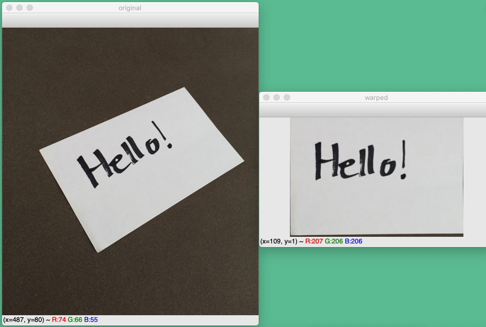
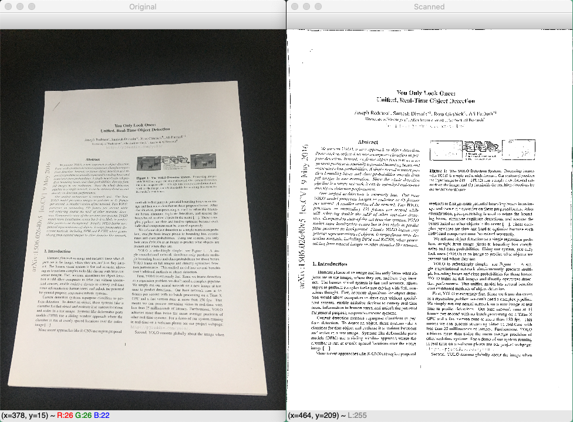

# blog文档/源码集

有关个人blog文章相关的文档/源码的合集，持续更新各种基础教程和应用实现ing... 

包括：机器学习、深度学习、爬虫等

> github项目：[blog_doc](https://github.com/NeroAsmarr/blog_doc)

> blog地址：[NEROASMAR.TOP](https://neroasmar.top/)

## 1. CNN网络自动识别验证码（keras实现）

文章地址：[CNN网络自动识别验证码（keras实现）](https://neroasmar.top/zhengfang-code/)（使用正方教务系统的验证码做实现）

github地址：[zhengfang-code](https://github.com/NeroAsmarr/blog_doc/tree/master/zhengfang-code)

结果展示：

## 2. LSTM网络对对联（pytorch实现）

文章地址：[LSTM网络自动对对联（pytorch实现）](https://neroasmar.top/couplet-lstm/)

github地址：[couplet-lstm](https://github.com/NeroAsmarr/blog_doc/tree/master/couplet-lstm)

结果展示：

## 3. Labelme

文章地址：[Label标注工具的批量转化处理与颜色和标签的对应](https://neroasmar.top/labelme-batch/)

github地址：[labelme_batch](https://github.com/NeroAsmarr/blog_doc/tree/master/labelme_batch)

## 4. Opencv透视变换

文章地址：[透视变换原理及其Opencv实现）](https://neroasmar.top/perspective-transform/)

github地址：[perspective-transform](https://github.com/NeroAsmarr/blog_doc/tree/master/perspective-transform)

结果展示：

## 5. OpenCV实现简单的文件扫描器

文章地址：[OpenCV实现简单的文件扫描器](https://neroasmar.top/document-scanner/)

github地址：[document-scanner](https://github.com/NeroAsmarr/blog_doc/tree/master/document-scanner)

结果展示：

## 6. batch_modify_file_content

文章地址：[一个批量替换文件内容的Python小脚本](https://neroasmar.top/batch_modify_file_content/)

github地址：[batch_modify_file_content](https://github.com/NeroAsmarr/blog_doc/tree/master/batch_modify_file_content)