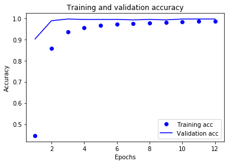

# blog文档/源码集

有关个人blog文章相关的文档/源码的合集，持续更新各种基础教程和应用实现ing... 

- github项目：[blog_doc](https://github.com/NeroAsmarr/blog_doc)

- blog地址：[NEROASMAR.TOP](https://neroasmar.top/)

## 1. CNN网络自动识别验证码

文章地址：[CNN网络自动识别验证码](https://neroasmar.top/fangzheng-code/)（文内用正方教务系统做演示）

github地址：[zhengfang-code](https://github.com/NeroAsmarr/blog_doc/tree/master/zhengfang-code)

内容展示：

- 原验证码图片：

- 模型验证精度：

- 结果展示：

## 2. 